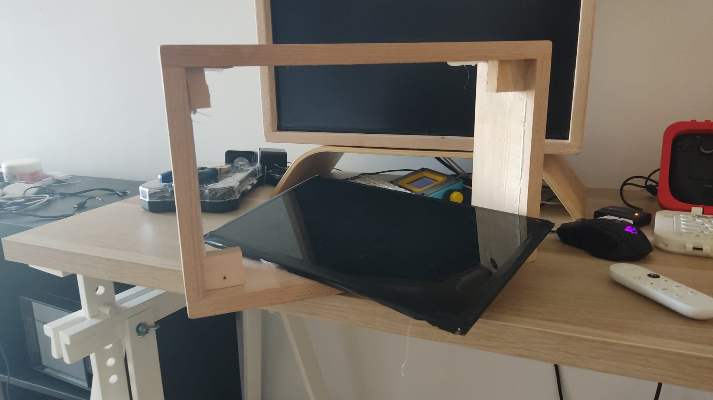

# Retro TV

A picture of complete build goes here.

This is an upcycle DIY build to make a little internet TV runs off a battery. From an old laptop, a display is harvested. Finding a fitting display controller. You get a display works with hdmi and many applications can be done with it. In this case, I have connected a Google TV dongle and a speaker to make a little portable TV. Something that can be used for a watching session on the bed or a little entertainment box on a desk. Or you can use it as a second monitor for your setup.

I have built the wooden framed enclosure previously. Wanted to upgrade to make it look like a retro TV. There are many guides how to make the harvested display to work. But couldn't find a good example that looks good. I wanted make a build that utilizes broken laptop and also looks attractive. 

# Bill of Material

* LCD screen harvested from an old laptop
* Display Controller matching the LCD
* HDMI Cable
* Small USB Powered PC Speaker
* Noise Cancelling pass through filter
* Google TV Dongle
* Wood Pieces for the enclosure

Materials can vary and the 3D printed enclosures can differ in dimensions. Please, use this guide to understand the approach to get the result you want. Using the exact material in this guide, may not be the optimal choice. You may have old laptops that have different type of display and discovering the controller board will be different than what I have.

# Harvesting Components from an old Laptop

When you have a broken laptop or old laptop that doesn't run too well these days. There are a lot of components that you can harvest before throwing it away. 

Here are the things that I would harvest before throwing it away. Those are the components that are useful for your diy projects and some of them are really rare or expensive to find.

* Display 
* Battery
* Hinges
* Keyboard Matrix
* Touch Pad

Batteries are nice components to harvest. It can be dangerous to operate with the battery. So make sure that you are aware of your doings before extracting the battery. They are often large capacity batteries that are very useful for most of electronic DIY projects.

Laptop monitor hinges solves a lot of problem in making a foldable designs in DIY projects. Laptop hinges are very strong and stable. These types of hinges are difficult to find or almost impossible to find. So, try to keep those hinges. They will definitely come in handy when you are building your dream DIY devices.

Some laptop keyboards are have very classic looks and if you can spend your time to figure out the matrix and connect it to a micro controller. You can build a very nice looking flat keyboard build. Some very small laptop may have a great and unique keyboard for your portable computer builds.

Laptop touch pads are high quality builds. They often use PS2 interface that can be connected rather easily to other systems. It's a good component to harvest and keep it for the later use. Once you get into a micro controller development. They will come in handy to make an elegant user interface hardware.

# Harvesting an LCD from an old laptop

Laptop displays are in decent sizes. You can dismount the display board from the laptop with some fiddling. Many old laptops have a good display. 

When a display board is harvested. You will need to find a display controller board. Which allows you to connect a hdmi cable or even USB display cable to it. 

To find the display controller. Type in the model number of the display to aliexpress or ebay. You will see many PCB that operates with your display. 

Link to a youtube guide that demonstrates goes here.

# Build Guide

Once you have a display and a controller. From here it's a matter of connecting and assembling it into an useful application. It's simply connecting a hdmi cable to something useful.

in my case, I have connected to Google TV dongle. This comes with a remote controller. Which makes a neat setup. A TV like setup where you can control what shows on the display with remote controller.

In this build. I wanted to place the remote controller next to the display and make it look like a channer controller on an old TV. It would fit the theme very nicely.

* This build guide is a draft and on going progress.